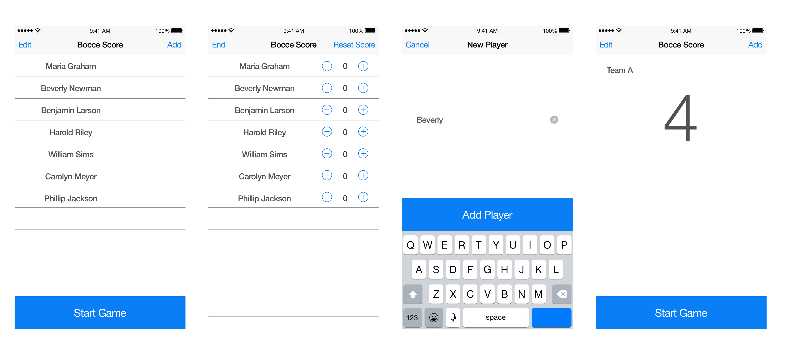

# sagacious-tatertot
Abandoned score keeping practice project. 

## MVP Tasks

### Add Player View

    [ ] Add a player name to a list
        [ ] add that name to the main list

    #### Stretch

        [x] Keyboard should be up at viewDidLoad
        [x] Caret should be in field at viewDidLoad
        [ ] Add Player button should be disabled until a name is entered
        [ ] Nice to have the Add Player button span the width of the view and be anchored to the top of the keyboard

### Player List View

    [ ] Start a game
    [ ] Delete a player from the player list

### Score View

    [ ] Increment player score up
    [ ] Increment player score down
    [ ] Reset scores
    [ ] End game and return to player list